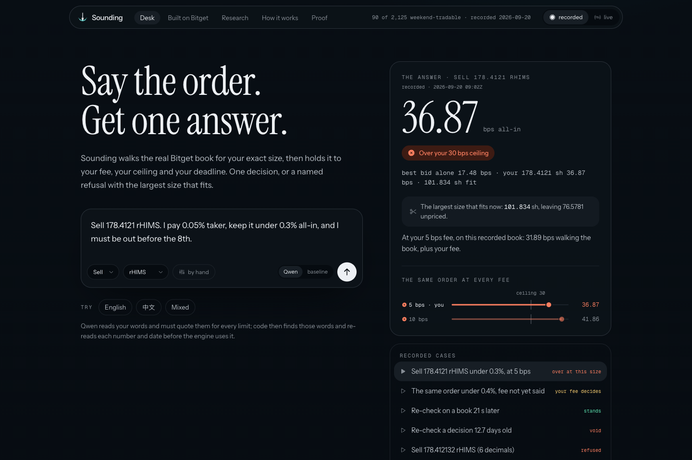
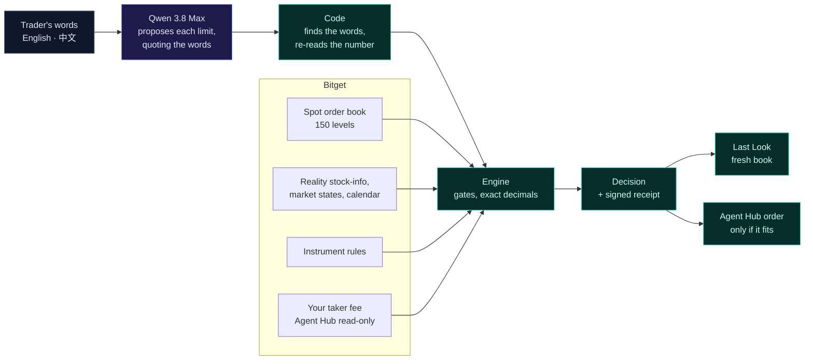

<div align="center">



&nbsp;

[](https://github.com/Cassxbt/sounding/actions/workflows/ci.yml)
[](LICENSE)


### Walk the book at your size. The best quote never decides.

When Nasdaq is shut, Bitget's own rToken order book is the market, and its best quote prices only your first shares. Sounding answers the question that comes before you confirm: **what does your whole order cost, at your own fee?** It walks **Bitget**'s book at your full size, holds it to your fee and ceiling, and gives one answer, or a named refusal with the largest size that fits. For an AI agent trading through **Bitget Agent Hub 2.0**, it puts that cost on the confirmation card the trader approves, and hands back the exact order only when it fits.

**[ Live desk ↗ ](https://sounding-zeta.vercel.app)** · **[ Judge it in 90 seconds ↗ ](#verify-it-yourself-in-90-seconds)** · **[ Take Bitget away ↗ ](https://sounding-zeta.vercel.app/bitget)** · **[ Proof ↗ ](https://sounding-zeta.vercel.app/proof)**

</div>

## ▶ Demo

A trader asks to sell 178.4121 shares of rHIMS and keep it under 0.3%. The best bid says 17.48 bps; the full order walks five levels down the book to 36.87 bps and is refused, with 101.834 shares named as the size that fits. An AI agent tries an order the book cannot carry through Agent Hub, whose dry run previews it as given; Sounding hands back no order. A size that fits comes back as the exact Agent Hub order, bound to a signed receipt.

Every frame is the deployed desk on recorded weekend Bitget books. Recording: linked here at submission.

## Contents

- [The problem I set out to solve](#the-problem-i-set-out-to-solve)
- [What I built](#what-i-built)
- [Verify it yourself in 90 seconds](#verify-it-yourself-in-90-seconds)
- [Architecture](#architecture)
- [How I integrated Bitget](#how-i-integrated-bitget)
- [Designed for agents: the refusal vocabulary](#designed-for-agents-the-refusal-vocabulary)
- [Engineering decisions and the hard problems](#engineering-decisions-and-the-hard-problems)
- [Numbers](#numbers)
- [What's real: the honesty table](#whats-real-the-honesty-table)
- [Run it locally](#run-it-locally)

## The problem I set out to solve

On weekends and US holidays Bitget matches rToken orders on its own book, with market makers ([Bitget support](https://www.bitget.com/support/articles/12560603893695)), and its own [weekend guide](https://www.bitget.com/academy/does-bitget-allow-24-7-us-stock-trading-weekend-liquidity) tells traders to check order-book depth, use limit orders and split large orders. A quote prices the first few shares. An order is all of them. A trader, or an AI agent acting for one, looks at the best bid on a Bitget rToken, adds a fee, and sees a cost inside their limit. The order then walks down the book and fills worse. On one recorded Sunday, at Bitget's published 5 bps rToken fee, the best ask said yes and the full order said no for 28 of the 89 weekend-tradable names a 25,000 USDT buy could fill.

Bitget's own agent stack has the same gap. Agent Hub's flow is a dry run, then a confirmation card naming pair, side, quantity and account, then the send. Its `pre_trade_check` reads the ticker price, the balance and the positions; nothing in the flow walks the book at the order's size. Its dry run previews whatever it is given: a 5,000-share rHIMS market sell the visible book cannot fill comes back as a ready preview.

So I treated *"the size does not fit"* as a first-class answer, sitting right next to *"the price looks fine."*

## What I built

1. **Read.** Qwen 3.8 Max reads the trader's words, English or 中文, and proposes each limit (size, fee, ceiling, deadline) with the exact words that state it.
2. **Check.** Code finds those words in the message and reads the number or date itself. A disagreement, an impossible date, a negative size, a corrected figure, or a limit mentioned but not read is asked back, never filled with a default.
3. **Walk.** The engine walks Bitget's book level by level at the full size, in exact decimals, with the taker fee charged on the traded amount. It does so on weekends and US holidays, when Bitget matches rToken orders on that book. In US sessions Bitget routes them to NASDAQ/NYSE, so Sounding refuses with `ROUTED_TO_US_MARKET` rather than price a book the order would not fill against.
4. **Decide.** Within the ceiling at a known fee, or over it with the largest size that fits. An unknown fee that changes the answer is asked.
5. **Look again.** Before acting, a fresh book is walked. The decision stands only within 10 bps and two minutes.
6. **Hand over.** For an agent, the exact Agent Hub `order` arguments, bound to a signed receipt, or a refusal with a reason.

## Verify it yourself in 90 seconds

No account, no key. Nothing is sent to the exchange. These run on the recorded Sunday rHIMS book, so the answers repeat on any day; `"mode":"live"` reads the book now, and on a weekday it is refused with `ROUTED_TO_US_MARKET`.

```bash
# An order the book cannot carry: refused, with the size that fits offered as a new order
curl -s https://sounding-zeta.vercel.app/api/prepare -H 'content-type: application/json' \
  -d '{"symbol":"RHIMSUSDT","side":"sell","amount":"5000","ceilingBps":40,"userFeeBps":5,"mode":"recorded"}'
# → {"preparation":{"status":"refused","code":"INSUFFICIENT_VISIBLE_DEPTH","reason":"the visible book cannot fill this order","proposal":{"size":"257.1401","unit":"sh",…}},…}

# An order that fits: the exact Agent Hub order, bound to its receipt
curl -s https://sounding-zeta.vercel.app/api/prepare -H 'content-type: application/json' \
  -d '{"symbol":"RHIMSUSDT","side":"sell","amount":"50","ceilingBps":40,"userFeeBps":5,"mode":"recorded"}'
# → {"preparation":{"status":"prepared","order":{"action":"place","category":"SPOT","symbol":"RHIMSUSDT","side":"sell","orderType":"limit","price":"27.98","timeInForce":"ioc","qty":"50"},"command":"bgc order --action place … --dry-run","binding":{…"allInBps":"19.89"…},"signed":…,"book":"recorded"},…}
```

Then open [/bitget](https://sounding-zeta.vercel.app/bitget), where the engine runs one order with each Bitget input withheld, and run every number in this README again:

```bash
pnpm install && pnpm verify
# PASS  lead.best-bid                  17.48 bps
# PASS  lead.full-size                 36.87 bps, over 30
# …
# 16/16 claims verified
```

## Architecture



The model reads and explains. It never does the arithmetic, and it cannot pass an order.

| | Gate | Refuses | Runs on |
|---|---|---|---|
| 1 | Instrument | a symbol not on Bitget's Reality list | every answer and every prepared order |
| 2 | Session | a US session, when Bitget routes the order to NASDAQ/NYSE instead of its own book, or a session its states and calendar cannot place | every answer and every prepared order |
| 3 | Weekend eligibility | a weekend order on a name Bitget does not flag weekend-tradable | every answer and every prepared order |
| 4 | Exchange constraints | a size off Bitget's quantity precision or under its minimum, naming a size it would accept where one exists | every answer and every prepared order |
| 5 | Book validity | an empty, crossed or malformed book | every answer and every prepared order |
| 6 | Freshness | a live book older than 5 s or slower than 2 s to arrive | every live answer and prepared order |
| 7 | Stability | two soundings of the same order more than 10 bps apart | the desk, between soundings |
| 8 | Checked reading | a limit the model cannot quote from your words, or that code reads differently | orders said in words |
| 9 | Rule checks | an answer with an unpriced route, an invented figure, a promised fill, or a loosened limit | the analyst's answer |
| 10 | Ceiling at a known fee | full size over your ceiling at your fee; an unknown fee that changes the answer is asked | every answer and every prepared order |
| 11 | Last Look | a fresh book more than 10 bps worse, a flipped verdict, or a decision older than two minutes | the desk, before acting |
| 12 | Binding | a prepared order changed after checking, not signed by this server, or older than two minutes | Agent Hub orders, before sending |

## How I integrated Bitget

| Bitget | Call | Without it |
|---|---|---|
| Spot order book | `GET /api/v2/spot/market/orderbook?limit=150` | refused: `NO_EXECUTABLE_QUOTE` |
| Reality stock-info | `GET /api/v3/reality/market/stock-info` | refused: `INVALID_INSTRUMENT` |
| Market states, calendar | `GET /api/v3/reality/market/states` · `/calendar` | refused: `SESSION_UNKNOWN` |
| Instrument rules | `GET /api/v3/market/instruments?category=SPOT` | refused: `INVALID_INSTRUMENT` |
| Agent Hub, read-only | `account_overview` (agent, the trader's account) · SDK 3.3.1 `getAccountFeeRate` (self-hosted, its operator's account) | the fee falls to the published 5 and 10 bps scenarios; an answer that depends on which is asked instead of prepared (sell 50 rHIMS under 20 bps on the recorded book: refused without a fee, prepared at 5 bps) |
| Agent Hub, order path | `order` tool · `bgc order --action place` | nothing receives the checked order: the answer stays advice, and an agent left to Agent Hub alone sends what it is told |
| Qwen on Bitget's S2 endpoint | `hackathon.bitgetops.com/v1` | the fallback reader cannot read "0.05%", "0.3%" or "before the 8th", and asks for limits already given |

The first four rows are computed by the engine on every build (`src/lib/deletion.ts`); the build fails if a removal stops changing the answer. Agent Hub, recorded on 2026-10-08 with a 40 bps ceiling and a stated 5 bps fee; Sounding's side runs on the recorded Sunday rHIMS book, where Bitget's own book is the market (`evidence/agenthub-20261008`):

| Order | Agent Hub dry run (`bgc` 3.0.0) | Sounding (`/api/prepare`, production) |
|---|---|---|
| sell 5000 | previews it | refused, `INSUFFICIENT_VISIBLE_DEPTH`: the visible book cannot fill it; 257.1401 sh offered as a new order |
| side `hold`, qty `-5` | previews it | rejected as input |
| sell 50 | previews it | prepared: 19.89 bps all-in, within 40, as the exact Agent Hub order (limit IOC at 27.98, the deepest bid walked), signed |

The fee is charged on the traded amount: buy `p + f + p·f/10⁴`, sell `p + f − p·f/10⁴`. A fee the trader states decides. An agent reads the trader's own fee with Agent Hub's `account_overview` and passes it in; a self-hosted Sounding with a read-only key reads its operator's fee through the SDK's `getAccountFeeRate`. Without either, Bitget's published 5 bps rToken rate and its 10 bps list rate are both priced, and an answer that differs between them is asked.

## Designed for agents: the refusal vocabulary

Every refusal is a code an agent can branch on, never prose alone.

| Where | Codes |
|---|---|
| Engine gates | `INVALID_INSTRUMENT` · `SESSION_UNKNOWN` · `ROUTED_TO_US_MARKET` · `UNAVAILABLE_THIS_SESSION` · `INVALID_BOOK` · `NO_EXECUTABLE_QUOTE` · `FRESHNESS_UNKNOWN` · `UNSTABLE_QUOTE` · `INVALID_QUANTITY_PRECISION` · `BELOW_MIN_ORDER` |
| Verdicts | `WITHIN_CEILING_ON_THIS_SNAPSHOT` · `OVER_CEILING_ON_THIS_SNAPSHOT` · `INSUFFICIENT_VISIBLE_DEPTH` |
| Preparation | `prepared` (with `order`, `binding`, `signed`, `book: live \| recorded`) · `refused` (with `reason` and, when one exists, `proposal`) |
| Verification | `ok`, or a reason: the order differs, not issued by this server, no signing key, older than two minutes |

- `agent/sounding-mcp.mjs`: a dependency-free MCP server with `sounding_prepare_order` and `sounding_verify_order`, to run beside `@bitget-ai/bitget-agent-mcp`.
- `agent/skills/sounding-precheck/SKILL.md`: a skill in Agent Hub's format. It runs after the dry run, adds the at-size cost to the confirmation card, and sends only the order Sounding prepared.

## Engineering decisions and the hard problems

- **The model never does arithmetic.** Qwen proposes and explains; code re-reads every value it quotes and checks every cost figure it writes (bps, %, 基点, 千分之) against the engine's output, English or Chinese. An answer that breaks one of 16 named rules is replaced by a deterministic template.
- **Ask, never default.** A size in words, a corrected fee, a past or impossible date, a negative size: each is a question back to the trader, never the form's value quietly priced instead.
- **The fee is charged on what is traded.** Adding the fee on top misjudges orders sitting near the ceiling, so every verdict, clip, chart and census cell uses the exact formula.
- **Correct in public.** The research first assumed a 20 bps fee. When an independent review showed Bitget publishes 5 bps, the census was restated on the same frozen books with the original figures left beside the new ones.
- **A recorded book is labelled; a prepared order expires.** Recorded answers say so, and a prepared order is good for two minutes, then the book is read again.

## Numbers

`pnpm verify` recomputes each row from the frozen books and the published runs, and fails on any difference.

<!-- SUMMARY:BEGIN -->
| claim | value | from |
|---|---|---|
| `lead.best-bid` | 17.48 bps | recorded rHIMS book, 5 bps fee |
| `lead.full-size` | 36.87 bps, over 30 | the same book, 178.4121 sh |
| `lead.fits` | 101.834 sh | the largest size within 30 bps |
| `census.5k-50` | 6 / 90 | best ask within 50 bps, 5,000 USDT buy over |
| `census.25k-50` | 28 / 89 | the same at 25,000 USDT |
| `census.fee-decides` | 17 / 89 | within at 5 bps, over at the 10 bps list rate |
| `census.median-5k` | 23.61 bps | median all-in, 5,000 USDT buy |
| `deletion.book` | NO_EXECUTABLE_QUOTE | lead order, book withheld |
| `deletion.stock-info` | INVALID_INSTRUMENT | stock-info withheld |
| `deletion.session` | SESSION_UNKNOWN | states and calendar withheld |
| `deletion.instruments` | INVALID_INSTRUMENT | instrument rules withheld |
| `deletion.qwen` | Asked, not answered | Qwen withheld |
| `eval.whole-task` | 28/30 (1 critical) vs 12/30 (3 critical) | blind set 2, Qwen vs baseline |
| `eval.reading` | 142/151 vs 19/151 | blind set 2, limits read |
| `agenthub.dry-run-previews` | 3 of 3 | `bgc` dry run, recorded |
| `agenthub.sounding-prepared` | 1 of 3 | `/api/prepare`, recorded |
<!-- SUMMARY:END -->

Why the model is needed: the same thirty blind tasks, with and without Qwen, run on engine 0.4.0 before the fee correction: 28 done right with 1 critical error, against 12 with 3. On 40 blind messages in English, 中文 and mixed, Qwen read 142 of 151 stated limits correctly; a regex reader read 19. Every turn is scored as rendered, and runs are published as they came out, misses included.

## What's real: the honesty table

| Capability | Status |
|---|---|
| Bitget books and metadata | **Real.** Live in live mode. Recorded mode replays frozen, hashed captures and says so on every answer. |
| Engine decisions and receipts | **Real.** Exact decimals; receipts hashed, signed, and replayable offline (`pnpm replay`). |
| Qwen reading and ruling | **Real**, on Bitget's S2 endpoint, checked by code on every turn. |
| Agent Hub fee read | **Real**, through Agent Hub's read-only client, recorded with a read-only key on the developer's machine (taker 5 bps, the same as Bitget's published promotional rate). The public site holds no key and never shows one account's fee as anyone else's; an agent passes the trader's own. |
| Which book fills | **Weekends and US holidays only.** Bitget's Stock 2.0 guide routes rToken orders to NASDAQ/NYSE in US sessions and matches them on its own book, with market makers, on weekends and US holidays. Sounding prices only the second case and refuses the first (`ROUTED_TO_US_MARKET`). Sampled on a weekday overnight (2026-10-08, 270 samples), the ticker's whole-share quotes beat the book's best ask 252 times, which is what a routed quote looks like (`evidence/routing-20261008`). |
| Weekend order type | **Limit IOC, prepared, never sent.** The prepared order is a limit at the deepest price the walk reached, immediate-or-cancel: Bitget fills no share past the price Sounding checked and cancels what it cannot fill at once. Bitget's weekend FAQ lists limit orders, and Agent Hub's `order` tool takes `price` and `timeInForce`; whether Bitget accepts IOC on an rToken over a weekend is not tested. |
| Agent Hub order | **Prepared, never sent.** Shown as a dry run: Bitget's demo environment listed 6 of the 90 weekend-tradable rTokens, all with empty books, when checked on 2026-10-05, so a paper fill would prove nothing. |
| Enforcement | **Advisory.** The skill tells an agent to send only what Sounding prepared; it cannot stop a client that skips it. |
| Fills | **Not promised.** Every answer is conditional on the snapshot it names; hidden liquidity and the future book are out of reach. |
| Research | **Real, corrected.** The census was restated on 2026-10-07 from 57/89 to 28/89 at 25,000 USDT; the originals remain on `/research`. Runs made on engine 0.4.0 say so. |
| Sampling | **Real, with a gap.** Every 30 minutes on a declared schedule; a 21-hour gap on Oct 4–5 is recorded, not filled (`evidence/atlas-202610`). |

## Run it locally

```bash
pnpm install
cp .env.example .env.local
pnpm dev        # http://localhost:3000
pnpm test       # 330 tests in 15 files
pnpm verify     # every claim above, recomputed
pnpm replay fixtures/rhims-20260920T090235Z.json sell 178.4121 30 5
```

| Variable | Purpose | Required |
|---|---|---|
| `BITGET_QWEN_API_KEY` | Qwen on Bitget's S2 endpoint; without it the deterministic reader and template answer | no |
| `BITGET_API_KEY` · `BITGET_SECRET_KEY` · `BITGET_PASSPHRASE` | a read-only Bitget key, used only to read the operator's taker fee through Agent Hub's SDK | no |
| `SOUNDING_RECEIPT_KEY` | signs receipts and prepared orders; without it nothing prepared can be verified | to verify |

The suite mirrors the claims: the lead order's figures, each Bitget input withheld, the exact fee formula at the ceiling, intake asking instead of defaulting (signed, zero, worded and corrected sizes and fees, impossible dates, English and Chinese), every figure in an answer checked against the engine, and a prepared order rejected when changed, unsigned or stale.

Next.js 16 · TypeScript · decimal.js · `@bitget-ai/bitget-agent-sdk` · Qwen 3.8 Max · vitest

---

Built for the **Bitget AI Base Camp Hackathon S2**, Track 3: AI Trading Desk · Execution Assistance, by [cassxbt](https://github.com/Cassxbt). MIT licensed.
