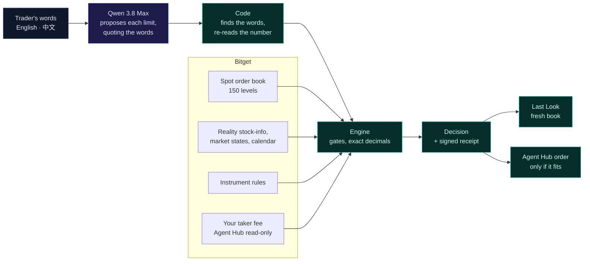

# Sounding: the best quote says yes, your size says no

> A quote prices the first few shares. Your order is all of them.

Sounding walks Bitget's rToken order book at your full size, holds the cost to your own fee and ceiling, and gives one answer: within, or over with the largest size that fits. For an AI agent trading through Bitget Agent Hub, it hands back the exact order only when the order fits.

| | |
|---|---|
| Live desk | https://sounding-zeta.vercel.app |
| Proof, recomputed at build | https://sounding-zeta.vercel.app/proof |
| Take Bitget away | https://sounding-zeta.vercel.app/bitget |
| Research | https://sounding-zeta.vercel.app/research |
| Hackathon | Bitget AI Base Camp S2 · AI Trading Desk · Execution Assistance |
| Engine | 0.5.0 · `pnpm test` · `pnpm verify` recomputes every claim below |
| Demo video | (link added at submission) |


**The fastest way to judge this needs no account and no key.**

1. Open the [desk](https://sounding-zeta.vercel.app). It opens on one real order on a recorded Bitget book: the best bid alone costs 17.48 bps, the full 178.4121 shares cost 36.87 bps, over a 30 bps ceiling, and 101.834 shares fit.
2. Open [/bitget](https://sounding-zeta.vercel.app/bitget). The engine runs that order with each Bitget input withheld, and Agent Hub's own dry run is shown next to Sounding on the same three orders.
3. Ask for an order yourself. Nothing is sent:
   ```bash
   curl -s https://sounding-zeta.vercel.app/api/prepare -H 'content-type: application/json' \
     -d '{"symbol":"RHIMSUSDT","side":"sell","amount":"5000","ceilingBps":40,"mode":"live"}'
   ```
   A size the book cannot carry comes back `refused`, with the largest size that fits as a new choice. A size that fits comes back `prepared`: the exact Agent Hub `order` arguments, bound to a signed receipt.
4. Re-run the numbers: `pnpm install && pnpm verify` recomputes every figure in the table below from the frozen books and the published runs.

## The failure it stops

An rToken trader, or an AI agent acting for one, looks at the best bid, adds a fee, and sees a cost inside the ceiling. The order then walks down the book and fills worse. Bitget's own agent flow has the same gap: a dry run, then a confirmation card naming pair, side and quantity, then the send. Nothing in it asks what the size costs.

On one recorded Sunday, at Bitget's published 5 bps rToken fee, the best ask said yes and the full order said no for 28 of the 89 weekend-tradable names a 25,000 USDT buy could fill, and 6 of 90 at 5,000 USDT.

## How it decides



The model reads and explains. It never does the arithmetic, and it cannot pass an order. Where each gate runs:

| | Gate | Refuses | Runs on |
|---|---|---|---|
| 1 | Instrument | a symbol not on Bitget's Reality list | every answer and every prepared order |
| 2 | Session | a session Bitget's states and calendar cannot place | every answer and every prepared order |
| 3 | Weekend eligibility | a weekend order on a name Bitget does not flag weekend-tradable | every answer and every prepared order |
| 4 | Exchange constraints | a size off Bitget's quantity precision or under its minimum, naming a size it would accept where one exists | every answer and every prepared order |
| 5 | Book validity | an empty, crossed or malformed book | every answer and every prepared order |
| 6 | Freshness | a live book older than 5 s or slower than 2 s to arrive | every live answer and prepared order |
| 7 | Stability | two soundings of the same order more than 10 bps apart | the desk, between soundings |
| 8 | Checked reading | a limit the model cannot quote from your words, or that code reads differently | orders said in words |
| 9 | Rule checks | an answer with an unpriced route, an invented figure, a promised fill, or a loosened limit | the analyst's answer |
| 10 | Ceiling at a known fee | full size over your ceiling at your fee; an unknown fee that changes the answer is asked | every answer and every prepared order |
| 11 | Last Look | a fresh book more than 10 bps worse, a flipped verdict, or a decision older than two minutes | the desk, before acting |
| 12 | Binding | a prepared order changed after checking, not signed by this server, or older than two minutes | Agent Hub orders, before sending |

The fee is charged on the traded amount: buy `p + f + p·f/10⁴`, sell `p + f − p·f/10⁴`. A fee you state decides. Your account's own fee is read through Agent Hub when a read-only key is configured. Without either, Bitget's published 5 bps rToken rate and its 10 bps list rate are both priced, and an answer that differs between them is asked.

## Bitget is load-bearing

| Bitget input | Call | Without it |
|---|---|---|
| Spot order book | `GET /api/v2/spot/market/orderbook?limit=150` | refused: `NO_EXECUTABLE_QUOTE` |
| Reality stock-info | `GET /api/v3/reality/market/stock-info` | refused: `INVALID_INSTRUMENT` |
| Market states, calendar | `GET /api/v3/reality/market/states` · `/calendar` | refused: `SESSION_UNKNOWN` |
| Instrument rules | `GET /api/v3/market/instruments?category=SPOT` | refused: `INVALID_INSTRUMENT` |
| Agent Hub, read-only | `@bitget-ai/bitget-agent-sdk` 3.3.1 `getAccountFeeRate` | the fee falls to the published scenarios, and an answer that depends on it is asked instead of prepared |
| Agent Hub, order path | `order` tool / `bgc order --action place` | nothing receives the checked order: the answer stays advice, and an agent left to Agent Hub alone sends what it is told (all three test orders below) |
| Qwen on Bitget's S2 endpoint | `hackathon.bitgetops.com/v1` | the fallback reader cannot read "0.05%", "0.3%" or "before the 8th", and asks for limits already given |

The first four rows are computed by the engine on every build (`src/lib/deletion.ts`); the build fails if a removal stops changing the answer. Agent Hub, recorded on 2026-10-07 on the live rHIMS book with a 40 bps ceiling (`evidence/agenthub-20261007`):

| Order | Agent Hub dry run (`bgc` 3.0.0) | Sounding |
|---|---|---|
| sell 5000 | would send | refused: the visible book cannot fill it; 578.4334 sh offered as a new order |
| side `hold`, qty `-5` | would send | rejected as input |
| sell 50 | would send | prepared: 14.62 bps all-in at the account's own 5 bps fee, read through Agent Hub |

## Why the model is needed

The same thirty blind tasks, with and without Qwen, run on engine 0.4.0 before the fee correction: 28 done right with 1 critical error, against 12 with 3. On 40 blind messages in English, 中文 and mixed, Qwen read 142 of 151 stated limits correctly; a regex reader read 19. Every turn is scored as rendered, and runs are published as they came out, misses included (`evidence/`).

## Claims, recomputed

`pnpm verify` recomputes each row and fails on any difference.

<!-- SUMMARY:BEGIN -->
| claim | value | from |
|---|---|---|
| `lead.best-bid` | 17.48 bps | recorded rHIMS book, 5 bps fee |
| `lead.full-size` | 36.87 bps, over 30 | the same book, 178.4121 sh |
| `lead.fits` | 101.834 sh | the largest size within 30 bps |
| `census.5k-50` | 6 / 90 | best ask within 50 bps, 5,000 USDT buy over |
| `census.25k-50` | 28 / 89 | the same at 25,000 USDT |
| `census.fee-decides` | 17 / 89 | within at 5 bps, over at the 10 bps list rate |
| `census.median-5k` | 23.61 bps | median all-in, 5,000 USDT buy |
| `deletion.book` | NO_EXECUTABLE_QUOTE | lead order, book withheld |
| `deletion.stock-info` | INVALID_INSTRUMENT | stock-info withheld |
| `deletion.session` | SESSION_UNKNOWN | states and calendar withheld |
| `deletion.instruments` | INVALID_INSTRUMENT | instrument rules withheld |
| `deletion.qwen` | Asked, not answered | Qwen withheld |
| `eval.whole-task` | 28/30 (1 critical) vs 12/30 (3 critical) | blind set 2, Qwen vs baseline |
| `eval.reading` | 142/151 vs 19/151 | blind set 2, limits read |
| `agenthub.dry-run-would-send` | 3 of 3 | `bgc` dry run, recorded |
| `agenthub.sounding-prepared` | 1 of 3 | `/api/prepare`, recorded |
<!-- SUMMARY:END -->

## What is real

| | |
|---|---|
| Books | Live Bitget books in live mode; frozen captures in recorded mode, each hashed and named by date. A recorded answer says so. |
| Orders | Nothing is ever sent. Agent Hub is shown as a dry run: Bitget's demo environment listed 6 of the 90 weekend-tradable rTokens, all with empty books, when checked on 2026-10-05, so a paper fill would prove nothing. |
| Account fee | Read through Agent Hub with a read-only key on the developer's machine and recorded. The public site holds no key and never shows one account's fee as anyone else's. |
| Enforcement | The Agent Hub skill tells an agent to send only what Sounding prepared. It cannot stop a client that skips it. |
| Fills | Not promised. Every answer is conditional on the snapshot it names; hidden liquidity and the future book are out of reach. |
| Corrections | On 2026-10-07 an independent review found the research priced an assumed 20 bps fee added on top of the walk. Engine 0.5.0 prices Bitget's published 5 bps, charged on the traded amount; the census went from 57/89 to 28/89 at 25,000 USDT. The original figures remain on `/research`. Runs made on engine 0.4.0 say so. |
| Sampling | Every 30 minutes on a declared schedule; a 21-hour gap on Oct 4–5 is recorded, not filled (`evidence/atlas-202610`). |

## For agents

- `agent/sounding-mcp.mjs`: a dependency-free MCP server (`sounding_prepare_order`, `sounding_verify_order`) to run beside `@bitget-ai/bitget-agent-mcp`.
- `agent/skills/sounding-precheck/SKILL.md`: a skill in Agent Hub's format. It runs after the dry run, adds the at-size cost to the confirmation card, and sends only the order Sounding prepared.

## Run it

```bash
pnpm install
cp .env.example .env.local
pnpm dev        # http://localhost:3000
pnpm test       # unit and route tests
pnpm verify     # every README claim, recomputed
pnpm replay fixtures/rhims-20260920T090235Z.json sell 178.4121 30 5
```

| Variable | Purpose | Required |
|---|---|---|
| `BITGET_QWEN_API_KEY` | Qwen on Bitget's S2 endpoint; without it the deterministic reader and template answer | no |
| `BITGET_API_KEY` · `BITGET_SECRET_KEY` · `BITGET_PASSPHRASE` | a read-only Bitget key, used only to read your own taker fee through Agent Hub | no |
| `SOUNDING_RECEIPT_KEY` | signs receipts and prepared orders; without it nothing prepared can be verified | to verify |

Next.js · TypeScript · decimal.js · `@bitget-ai/bitget-agent-sdk` · Qwen 3.8 Max · vitest.

Built by [cassxbt](https://github.com/Cassxbt).
