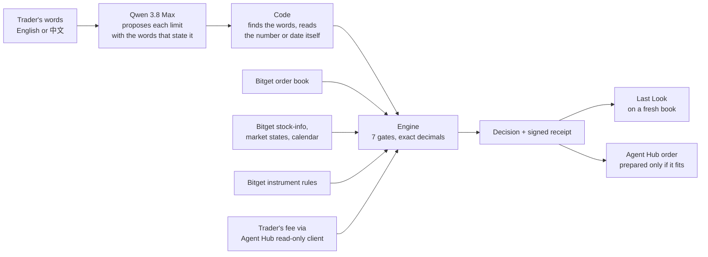

# Sounding

**The best quote says yes. Your size says no.** Sounding walks Bitget's rToken order book at your full order size, against your own fee and cost ceiling, and tells you before you trade whether it fits. For an AI agent trading through Bitget Agent Hub, it hands back the exact order only when it does.

[Live desk](https://sounding-zeta.vercel.app) · [Built on Bitget](https://sounding-zeta.vercel.app/bitget) · [Proof](https://sounding-zeta.vercel.app/proof) · [Research](https://sounding-zeta.vercel.app/research)

Bitget AI Base Camp Hackathon S2 · AI Trading Desk · Execution Assistance


## The order it opens on

> "Sell 178.4121 rHIMS. I pay 0.05% taker, keep it under 0.3% all-in, and I must be out before the 8th."

On the recorded Sunday rHIMS book, at the trader's 5 bps fee:

| | all-in cost |
|---|---|
| The best bid alone | 17.48 bps, inside the 30 bps ceiling |
| The full 178.4121 shares, walked 5 levels down the book | **36.87 bps, over** |
| The largest size that fits | 101.834 shares, the remaining 76.5781 left unpriced |

A quote-based check says yes. Sounding says no, says by how much, and names the size that does fit. Because the trader must be out by a date, it does not offer a partial as an exit.

## How it decides



- **Qwen reads; code checks.** The model never does arithmetic. Every limit it reads must quote the trader's words, and code re-reads the number or date from those words. Disagreements, impossible dates, negative sizes and limits mentioned but not read are asked back.
- **The engine decides.** The book is walked level by level at the full size, in exact decimals, with the taker fee charged on the traded amount. A stated fee decides. Without one, Bitget's published 5 bps rToken rate and the 10 bps list rate are both priced, the higher decides, and an answer that differs between them is asked.
- **Every answer is checked.** Qwen's ruling on the routes is checked in code against 14 named rules (no route the engine did not price, no figure the engine did not produce, no promise of a fill, the trader's language). An answer that breaks one is replaced by a deterministic template.
- **Last Look.** Before acting, a fresh book is walked again. The decision stands only within 10 bps and two minutes.

## Bitget is load-bearing

The engine runs the lead order with each input withheld (`src/lib/deletion.ts`, run as part of the build):

| Withheld | What happens |
|---|---|
| Order book | refused: `NO_EXECUTABLE_QUOTE` |
| Reality stock-info | refused: `INVALID_INSTRUMENT` |
| Market states and calendar | refused: `SESSION_UNKNOWN` |
| Instrument rules | refused: `INVALID_INSTRUMENT` |
| Qwen | the fallback reader cannot read "0.05%", "0.3%" or "before the 8th", so it asks for limits already given |

**Agent Hub.** Bitget Agent Hub lets an AI agent trade a Bitget account. Its flow is a dry run, then a confirmation card naming pair, side and quantity, then the send; nothing in it asks what the size costs. Recorded on 2026-10-07 (`evidence/agenthub-20261007`):

| Order, live rHIMS book, 40 bps ceiling | Agent Hub dry run (`bgc` 3.0.0) | Sounding |
|---|---|---|
| sell 5000 | would send | refused: the visible book cannot fill it; a smaller size offered as a new order |
| side `hold`, qty `-5` | would send | rejected as input |
| sell 50 | would send | prepared: the exact Agent Hub `order` arguments, bound to the receipt, at the account's own 5 bps fee read through Agent Hub |

## Evidence

| Claim | Result | Where |
|---|---|---|
| Whole tasks done right, blind set, every turn checked | 28 of 30 with Qwen (1 critical) vs 12 of 30 without (3 critical) | `evidence/wholetask-eval-v2-heldout` |
| Limits read correctly from 40 blind messages, EN and 中文 | 142 of 151 with Qwen vs 19 of 151 by regex | `evidence/paraphrase-eval-v2-heldout` |
| Best ask within 50 bps, full order over, 90 weekend-tradable rTokens at 5 bps | 6 of 90 at 5,000 USDT; 28 of 89 at 25,000 USDT | `evidence/census-20260920`, recomputed on `/research` |
| Same question every 30 minutes across sessions | a schedule declared before the first capture; every round kept, failures included; counts by session on `/research` | `evidence/atlas-202610` |
| The public book matches Bitget's web book | 10 of 10 top levels, same second | `/proof` |

Evaluation runs are published as they ran, misses included; development reruns are labelled as such.

## Corrections

On 2026-10-07 an independent review found that the research assumed a 20 bps fee added on top of the walk. Bitget publishes a 5 bps rToken taker fee (VIP 0-4, promotion extended 2026-09-01), charged on the traded amount. Engine 0.5.0 prices this way, and the census was restated from the same frozen books: 57 of 89 became 28 of 89 at 25,000 USDT. The original figures remain on `/research` and in `evidence/census-20260920/FINDINGS.md`. Evaluation runs made on engine 0.4.0 are labelled with that version.

## Run it

```bash
pnpm install
cp .env.example .env.local   # add a Qwen key; a Bitget read-only key is optional
pnpm dev                     # http://localhost:3000
pnpm test
pnpm replay fixtures/rhims-20260920T090235Z.json sell 178.4121 30 5
```

| Variable | Purpose | Required |
|---|---|---|
| `BITGET_QWEN_API_KEY` | Qwen on the hackathon endpoint; without it the deterministic reader and template answer | no |
| `BITGET_QWEN_BASE_URL`, `BITGET_QWEN_MODEL`, `BITGET_QWEN_THINKING` | endpoint overrides | no |
| `BITGET_API_KEY`, `BITGET_SECRET_KEY`, `BITGET_PASSPHRASE` | a **read-only** Bitget key, used only to read your own taker fee through Agent Hub | no |
| `SOUNDING_RECEIPT_KEY` | signs receipts and prepared orders; without it nothing prepared can be verified | for `/api/prepare` verification |

## For agents

- `agent/sounding-mcp.mjs`: a dependency-free MCP server with `sounding_prepare_order` and `sounding_verify_order`, run beside `@bitget-ai/bitget-agent-mcp`.
- `agent/skills/sounding-precheck/SKILL.md`: a skill in Agent Hub's format. It adds the at-size cost to the confirmation card and sends only the order Sounding prepared. It is a check the agent chooses to run; it cannot stop a client that skips it.

## What it does not do

It never sends an order and promises no fill. Every answer is conditional on the snapshot it names. It cannot see hidden or off-book liquidity, Bitget's whitelisted Reality depth feed, or the future book.

Built by [cassxbt](https://github.com/Cassxbt).
